<div align="center">

# 🌱 StartWise

**Start wise. Launch right.**

A warm, voice-first business saathi for first-time women founders. Tell it your idea in **English, Hindi or Marathi**, and it grows into a tested, source-backed plan, then walks with you to your first customer and beyond.

**She Solves 3.0** · Web & Software Development · Domain: Entrepreneurship · **Team200OK**

🔗 **Live app:** _<add Vercel link>_ · 🎬 **Ready-made example for judges:** _<add Vercel link>_/demo (Sunita's home bakery, no login needed)

</div>

---

## Contents

1. [Problem statement](#1-problem-statement)
2. [Proposed solution](#2-proposed-solution)
3. [Screenshots](#3-screenshots)
4. [Features implemented](#4-features-implemented)
5. [Tech stack](#5-tech-stack)
6. [Installation & setup](#6-installation--setup)
7. [How to run](#7-how-to-run)
8. [Deployment](#8-deployment)
9. [Project structure](#9-project-structure)
10. [Known limitations](#10-known-limitations)
11. [Future scope](#11-future-scope)
12. [Team](#12-team)

---

## 1. Problem statement

Aspiring entrepreneurs, especially first-time women founders starting from home, have ideas but **no trusted guide to launch them**. The early journey is scattered: checking whether people will buy, working out costs and a fair price, finding which licences apply, discovering funding schemes and remembering what to do each day all happen in different places, mostly in English and full of jargon. Generic AI chat gives one-off answers that can be outdated or invented, and paid agents handle only one task. She can describe her business, but has no single, kind, step-by-step guide that turns *a thought* into *a business she can run*.

## 2. Proposed solution

StartWise is a **launch companion, not a one-time chat answer**. It feels like talking to a friend, keeps everything about her business in one place, and remembers her progress.

1. **Talk about the idea**: a warm chat (voice or text, in her language) that asks questions specific to *her* idea, while a card beside it fills in her business live.
2. **See her business**: "Here's your business" in plain words, and a first step.
3. **Test before spending**: a 7-day, ₹0–500 test with a GO / NO-GO verdict, where every day has a **"Help me do this"** button that does the hard part for her.
4. **Plan it**: costs and price, only the licences that apply, matching government schemes.
5. **Launch and sell**: marketing plan, order book, sales diary, first customers.
6. **Keep growing**: after her first sale, **Season 2** sets new goals, and fresh ideas start a new conversation every day. There is no dead end.

Her progress is **a plant that grows**: StartWise (the watering can) waters her idea, each finished step grows a leaf, her first sale makes it bloom, and in Season 2 it bears fruit.

> **Core principle:** *AI understands and explains; reviewed data and formulas decide.* Licences, scheme matches, every number and the GO / NO-GO verdict come from reviewed data and plain TypeScript formulas, so the same profile always gives the same answer. Every legal fact links to its official source with a verified date.

Pilot scope: **Pune and Maharashtra**. Any business idea is welcome (home food, tailoring, tuition, candles, reselling, salons…); food, tailoring and online reselling have the deepest reviewed data.

## 3. Screenshots

| Welcome: the plant grows, the phone chats by itself | Chat, with the business filling in live |
| :---: | :---: |
| 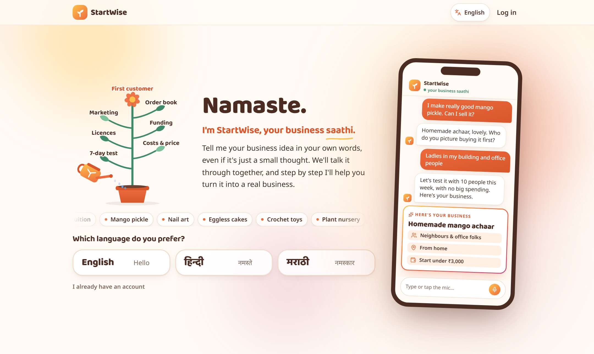 | 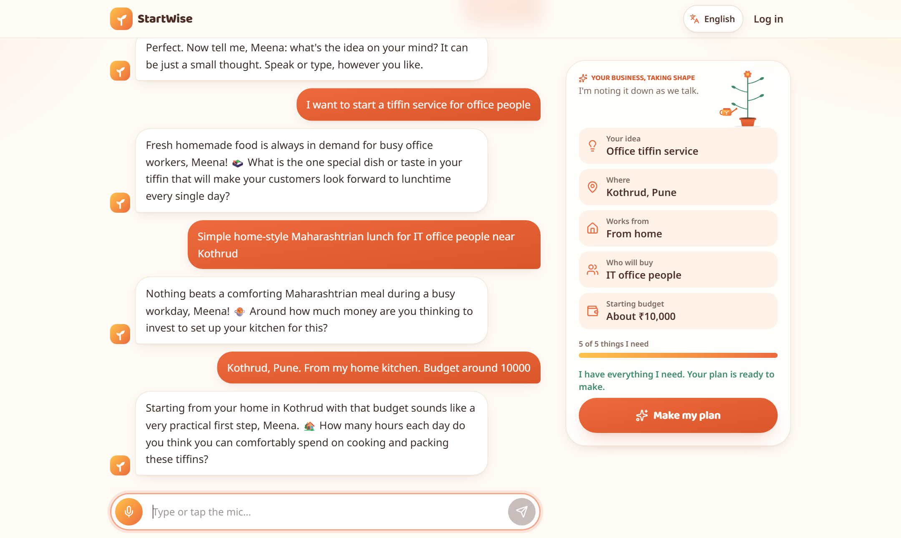 |
| **Plan home: one next step, her plant beside it** | **Season 2: "Grow", with fruit goals and daily ideas** |
| 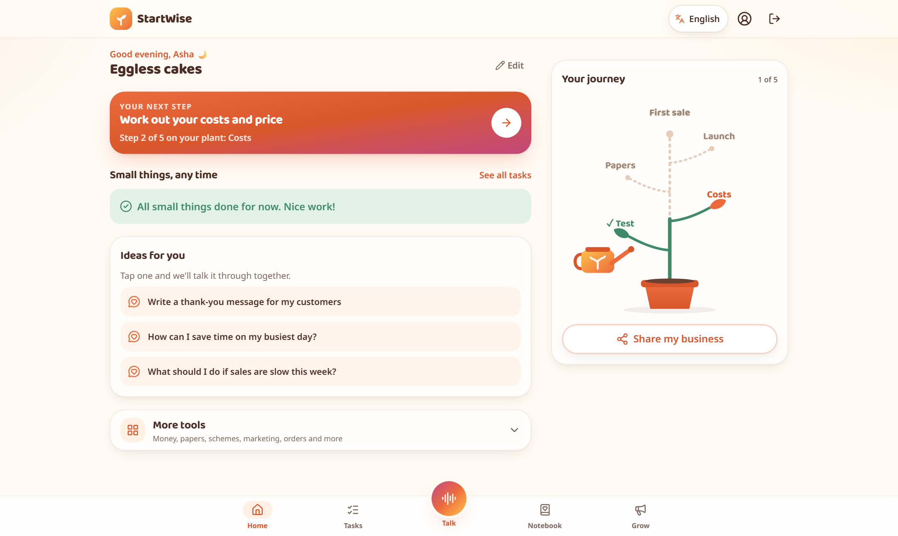 | 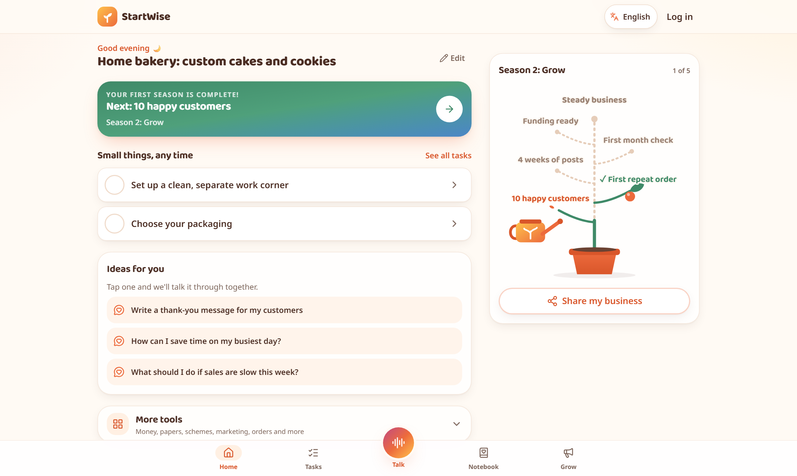 |
| **7-day test: tick each day, "Help me do this"** | **What papers do I need? Only what applies, with sources** |
| 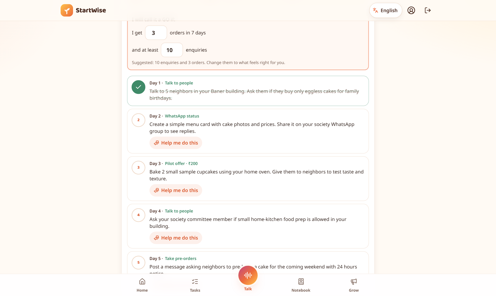 | 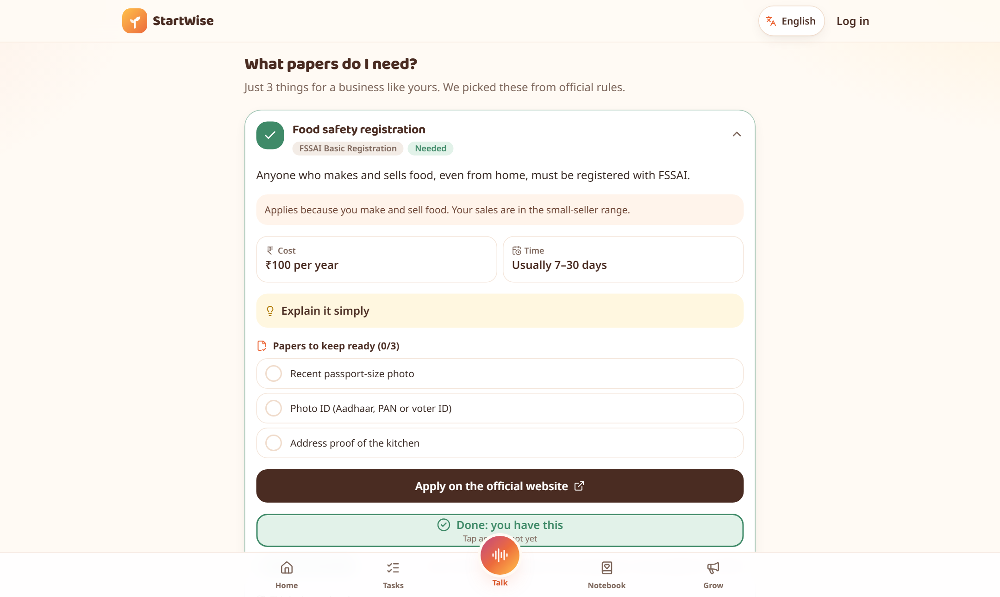 |
| **Funding: matching schemes and a loan pitch** | **Marketing buddy: weekly posts with reminders** |
| 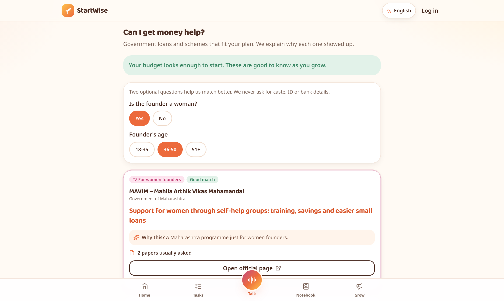 | 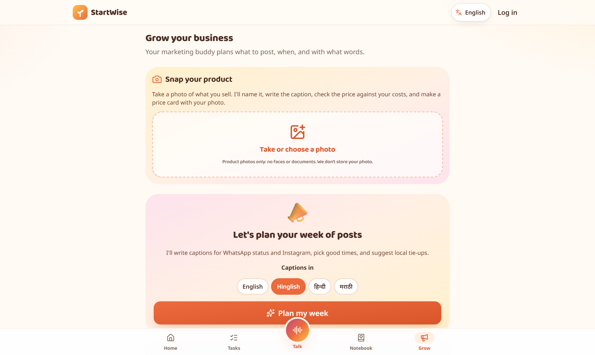 |

| Plan home in Hindi | "Help me do this": 5 questions to ask | Money in Marathi | Her status picture, made in one tap | Talk: ideas become conversations |
| :---: | :---: | :---: | :---: | :---: |
| 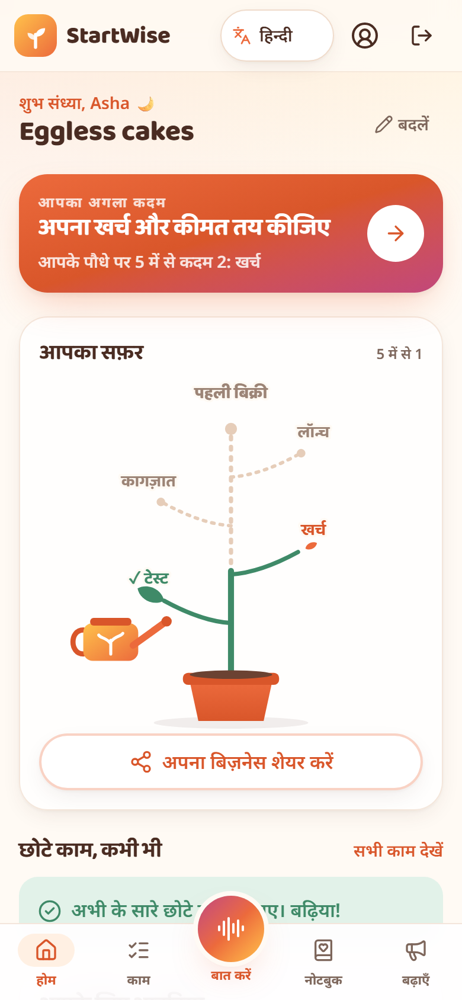 | 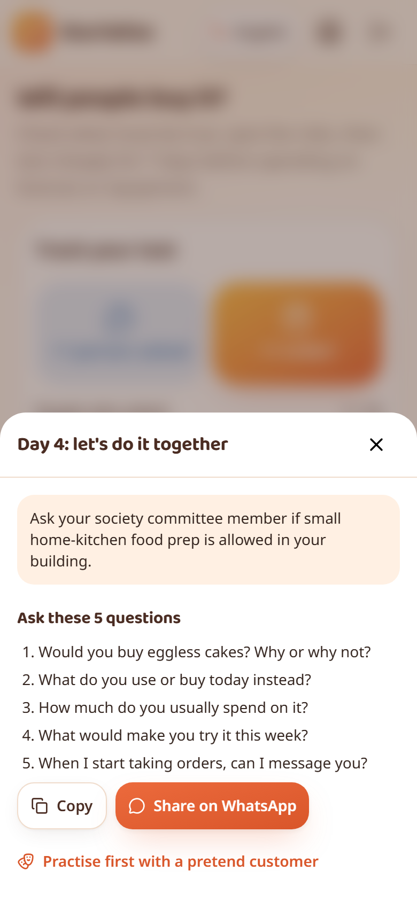 | 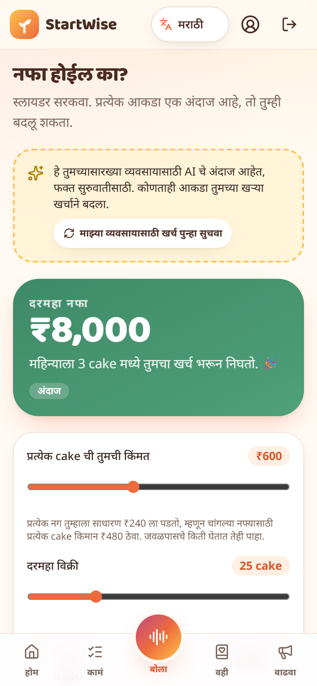 |  | 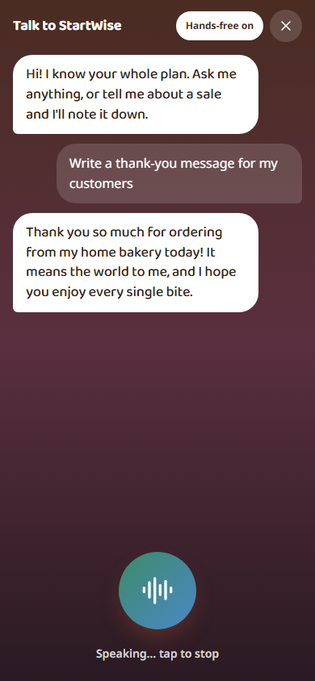 |

## 4. Features implemented

### The first five minutes (a conversation, never a form)
| Feature | What it does |
| --- | --- |
| **Warm front door** | "Namaste." and *"Which language do you prefer?"* (English · हिन्दी · मराठी). The StartWise plant grows on screen and a sample chat plays on a little phone, so she understands the idea at once. Fits on one screen, phone or laptop. |
| **A real conversation** | Asks her name and whether to **speak replies aloud or just show text**, then explores *her* idea first: a tutor, a baker and a restaurant owner get different questions, never the obvious ones. Location and budget come later, with tap-to-answer chips. |
| **Business taking shape (laptop)** | Beside the chat, a card fills itself in as StartWise understands her (idea, area, home or shop, who will buy, budget), with a soft light on each new fact and a tiny plant that grows. |
| **Voice in three languages** | Live words while she speaks; Gemini transcribes the recording for accurate Hindi, Marathi and Hinglish. Replies can be read aloud. Typing always works. |
| **Log in only when it matters** | Guests chat freely. Tapping **Make my plan** asks her to save it: **Continue with Google** or email + password. Her guest chat moves into her account. Logged-in founders get *"Welcome back"*. |
| **Here's your business** | Her business in plain words (what, where, who for, budget), a first step, read-aloud, and "change something". |

### Her plan
| Feature | What it does |
| --- | --- |
| **One clear path** | The plan home shows **one next step**, and it always follows the step pulsing on her plant ("Step 2 of 5 on your plant: Costs"). Small any-time jobs sit apart; everything else waits under **More tools**. A 3-step tour on the first visit. |
| **Her growing plant** | Test → Costs → Papers → Launch → First sale. Finished steps become leaves, the current one pulses, future ones are dashed. When she finishes a step and comes back, the new leaf grows in front of her: *"Your plant grew a new leaf"*. Every branch can be tapped. |
| **Each step finished on its own page** | GO on the 7-day test · **"I've set my price"** on Money · **"I've got this"** on each licence · **"I've told people I'm open"** on Marketing · the first order in her order book is her first sale. |
| **Season 2: Grow (no dead end)** | After her first sale, the banner says *"Your first season is complete. Next: 10 happy customers"*. The plant bears fruit for **10 happy customers, first repeat order, 4 weeks of posts, first-month check, funding ready**, each counted from her real data. |
| **Ideas for you** | Three fresh questions every day ("Give me a festival special idea", "Write a thank-you message for my customers"…). One tap opens Talk with the question asked. |
| **Share my business** | Turns her business and plant into a "Launching soon" picture for WhatsApp Status (Devanagari renders correctly). |
| **Delightful waiting** | While the AI works, a sprout is watered and useful tips rotate in her language, instead of a spinner. |

### Tools
| Area | What works today |
| --- | --- |
| **Will people buy it?** | Assumptions and risk check, a 7-day test (₹500 cap enforced in code), her own GO line (saves itself), **+1 asked / +1 order** tracker and automatic **GO / NO-GO**. Each day can be ticked off, today is marked, and **"Help me do this"** gives 5 questions to ask, makes her status picture or flyer, or hands her a ready message. **"Remind me every day"** adds 10 AM calendar alarms. Ready WhatsApp message, poll and price card, all shareable. |
| **Will I make money?** | Starting costs estimated for *her kind* of business (clearly labelled), editable one-time, monthly and per-item costs, price and sales sliders, live profit and break-even in her own unit ("tiffins", "students"), best/likely/worst cases, a 90-day cash chart and loan need. |
| **What papers do I need?** | **Verified against official sources on 4 Oct 2026.** A rule engine shows only the licences that apply, each with a plain name, why, cost, time, a papers checklist, "explain it simply", the official link, verified date, source and "this looks outdated". Optional ones (Udyam) are marked *Recommended*. |
| **Can I get money help?** | MUDRA, PMEGP, CMEGP, Stand-Up India, MAVIM, CGTMSE matched to her answers, with *why this?*, papers needed, women-focused schemes highlighted, and a **bank loan pitch** written from her own numbers. |
| **Talk to StartWise** | A voice assistant (centre of the bottom bar) that knows her whole plan. It actually does things: writes the message she asks for (with Copy and WhatsApp), adds tasks, logs sales and opens the right screen. |
| **Marketing buddy** | A weekly WhatsApp/Instagram plan with times, captions in English, Hinglish, Hindi or Marathi, photo tips, **Remind me** (Google Calendar), festival tips, local partnership ideas, brand-name ideas, a price-card image and **Photo → product** captions. |
| **Order book** | Say an order (*"Priya, 2 tiffins Sunday 5 pm, 400, 100 advance"*) and it fills itself in; what's due today, what's still to collect, WhatsApp confirmations. |
| **First customers** | Voice sales diary, monthly totals, a customer list with follow-ups, and a free starter kit (WhatsApp Business, UPI QR, Google Business Profile). |
| **Idea notebook + Worry box** | Messy thoughts by voice; **Shape my thoughts** groups them and suggests next steps; the worry box answers fears calmly with one small step for today. |
| **Practice room** | Rehearse out loud with an AI bank officer, a haggling customer or an office buyer, then get kind feedback. |
| **Who sells nearby?** | A map of similar businesses around her (OpenStreetMap) and reviewed Pune price ranges. |
| **Tasks, Launch Pack, Account** | Full task list with notes and "I'm stuck"; the whole plan as one A4 PDF in her language; language switch, log out and **delete my data**. |
| **Trust & privacy** | Source and verified status on every rule; *Guidance, not legal advice*; no Aadhaar/PAN/bank details collected; redaction before every AI call; each user sees only her own plans. |

## 5. Tech stack

| Layer | Technology |
| --- | --- |
| Frontend | **Next.js 16** (App Router, React 19, Server Actions), **TypeScript**, **Tailwind CSS 4**, **Motion** (animations), lucide icons, Recharts, Leaflet |
| Languages | **next-intl** with message files for English, Hindi and Marathi; Noto Sans, Noto Sans Devanagari and Baloo 2 fonts |
| Voice | Browser **Web Speech API** (live preview) + **Gemini** audio transcription; spoken replies with the device voice or **Gemini TTS** |
| Backend | Next.js server actions and route handlers |
| Database & auth | **Supabase** Postgres + Auth (JWT sessions, Google sign-in, email + password, anonymous guest sessions), **Drizzle ORM**, row-level security on |
| AI | **Google Gemini** (`gemini-flash-latest`, `gemini-flash-lite-latest`) via plain `fetch`, strict JSON checked with **zod**, automatic fallback to a second model and a backup key on rate limits or timeouts |
| Maps | OpenStreetMap tiles, Nominatim, Overpass API |
| Testing | **Vitest** (61 tests: rule engine, money formulas, verdict, reminders, language guardrails) · ESLint · TypeScript |
| Hosting | **Vercel** + Supabase (all free tiers) |

### How the AI is used (and where it is not)

| Task | Done by |
| --- | --- |
| Understand her words → structured business profile | AI (strict JSON) |
| Which licences apply, which schemes match | **Code + reviewed data** |
| Costs, break-even, cash flow, GO / NO-GO, plant progress | **Code (formulas)** |
| Plain-language explanations of rules | **Reviewed text** (3 languages) |
| Chat questions, test plan, messages, captions, loan pitch, notebook shaping, worry answers | AI drafts, always editable |

## 6. Installation & setup

**Requirements:** Node.js 20.9+, a free [Supabase](https://supabase.com) project and a free Gemini API key from [aistudio.google.com](https://aistudio.google.com/apikey).

```bash
git clone https://github.com/tanvisheth1234-wq/startwise.git
cd startwise
npm install
cp .env.example .env.local     # then fill in the values below
npm run db:push                # creates the tables in your Supabase database
```

### Environment variables (`.env.local`)

| Variable | What |
| --- | --- |
| `NEXT_PUBLIC_SUPABASE_URL`, `NEXT_PUBLIC_SUPABASE_ANON_KEY` | Supabase project URL and anon key |
| `SUPABASE_SERVICE_ROLE_KEY` | Server only: used for "delete my data" |
| `DATABASE_URL` | Postgres connection string (Supabase transaction pooler, port 6543) |
| `AI_PROVIDER` | `gemini` |
| `AI_API_KEY` | Gemini API key |
| `AI_API_KEY_2` | Optional backup key, used automatically on rate limits |
| `AI_MODEL`, `AI_EMBED_MODEL` | `gemini-flash-latest`, `gemini-embedding-001` |
| `ADMIN_EMAILS` | Comma-separated emails allowed to open `/admin` |
| `NEXT_PUBLIC_APP_URL` | Base URL, e.g. `http://localhost:3000` |

### Supabase settings
- **Authentication → Sign In / Providers:** turn on **Allow anonymous sign-ins** (guests start without an account) and **Email**. For quick testing, turn off **Confirm email**.
- **Google sign-in (optional):** create an OAuth *Web application* client in Google Cloud with the redirect URI `https://<project>.supabase.co/auth/v1/callback`, then paste its Client ID and secret in **Providers → Google**.
- **Authentication → URL Configuration:** add `http://localhost:3000/**` (and your live URL) to the redirect URLs.

> **Credentials for evaluators:** none needed. Open the app and start as a guest, sign up with any email, or open **`/demo`** for a complete example plan. Never commit `.env.local`.

## 7. How to run

```bash
npm run dev        # development server at http://localhost:3000
npm run build      # production build
npm start          # run the production build
npm test           # unit tests
npm run lint       # ESLint
```

**Try it:** open the app → pick **मराठी** (or any language) → tell it your name → choose *Speak* or *Just text* → describe an idea (e.g. *"मला घरून डबा सर्विस सुरू करायची आहे"*) → chat → **Make my plan** → sign up → follow the next step, and watch your plant grow. Or open **`/demo`** to jump straight into a complete plan.

## 8. Deployment

Deployed on **Vercel** (free) with **Supabase** (free).

1. Import the GitHub repository in Vercel (framework: Next.js, default build settings).
2. Add every variable from `.env.local` in **Vercel → Settings → Environment Variables**, with `NEXT_PUBLIC_APP_URL` set to the live URL.
3. Deploy, then add `https://<live-url>/**` to **Supabase → Authentication → URL Configuration → Redirect URLs** so Google login returns to the live site.

## 9. Project structure

```
startwise/
├── app/                          # Next.js routes
│   ├── page.tsx                  # Front door: hello + language, or "Welcome back"
│   ├── new/                      # The first conversation (+ live business card)
│   ├── demo/                     # Complete example plan for judges
│   ├── plan/[planId]/            # Plan home (plant, next step, ideas) and every tool
│   │   ├── profile/  validate/  money/  compliance/  funding/  market/
│   │   ├── roadmap/  notebook/  marketing/  first-customers/  orders/  practice/
│   │   └── launch-pack/ (+ print/)
│   ├── account/  login/  admin/
│   └── api/voice/                # transcribe (speech → text) and speak (text → speech)
├── src/
│   ├── knowledge/data.ts         # Reviewed rules, schemes, sources, tasks, cost estimates
│   ├── features/<module>/        # One folder per module: api, actions, components, lib (+ tests)
│   │   ├── compliance/engine.ts  # Pure rule engine
│   │   ├── money/lib/calc.ts     # Money formulas
│   │   ├── validate/lib/         # GO / NO-GO verdict, 7-day reminders
│   │   └── dashboard/            # Plan home, plant progress, Season 2, share card
│   ├── components/ui/            # Warm UI kit, GrowingPlant, animations
│   ├── lib/ai/                   # The only code that talks to the AI (guardrails, redaction, fallbacks)
│   ├── lib/auth/  lib/supabase/  # Sessions, guest accounts, data isolation
│   ├── db/schema/                # Drizzle schema (RLS on)
│   └── contracts/                # Shared types between modules
├── messages/{en,hi,mr}/          # Every on-screen word in three languages
└── docs/screenshots/
```

## 10. Known limitations

- FSSAI, Udyam, MUDRA and Stand-Up India were **verified on 4 Oct 2026**; GST, PMEGP, CMEGP, MAVIM and CGTMSE show **"Check locally"** until confirmed. Every record links to its official source.
- **Google sign-in** is in Google's testing mode (works for the team's test accounts); everyone can sign up with email.
- Pilot data covers **Pune / Maharashtra**; other cities get general rules.
- Uses **free Gemini tiers**: AI steps take a few seconds (shown with a friendly waiting screen) and can slow down under heavy use; a backup model and key take over automatically.
- Reminders are calendar files rather than push notifications (free and reliable on every phone).
- Live words while speaking work best in Chrome/Edge; other browsers still get the accurate transcript after recording.
- Guests aren't remembered between visits; logging in keeps a plan.

## 11. Future scope

- More cities and states (adding a city means adding reviewed data, not code) and more business types
- Phone-number login with OTP, and a mobile app (PWA) with push reminders
- WhatsApp bot: talk to StartWise and log orders from WhatsApp
- Ask-a-question box answering only from official source pages (texts and ingestion script already in the repo)
- Mentor and expert connect (CA, legal aid, self-help groups) and local founder communities
- Real-time scheme updates and links to UPI / accounting tools

## 12. Team

**Team200OK**: Twissha Shah · Yaadi Chhadva · Simrit Kaur Chhatwal · Tanvi Sheth

---

<sub>Guidance, not legal advice. Fees, limits and eligibility can change; always confirm on the official portal. Sources: FoSCoS (FSSAI), Udyam Registration, GST portal, PMC, MUDRA, PMEGP (KVIC), Stand-Up India, Startup India, CMEGP, MAVIM, CGTMSE, OpenStreetMap.</sub>
