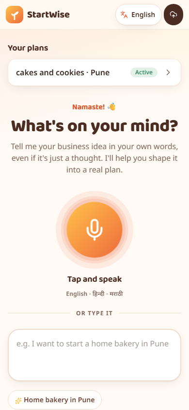
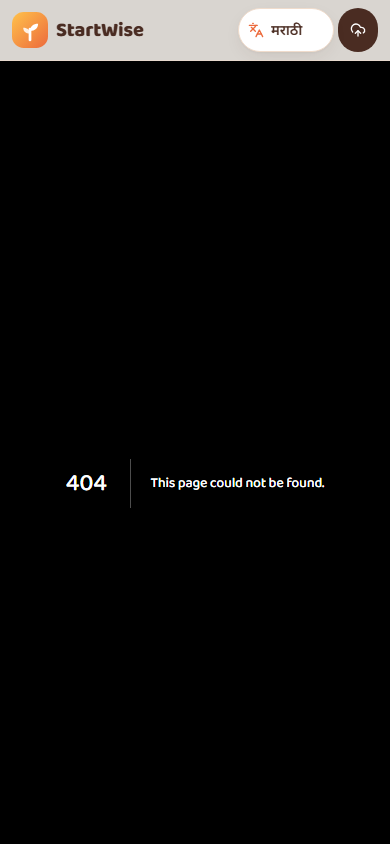
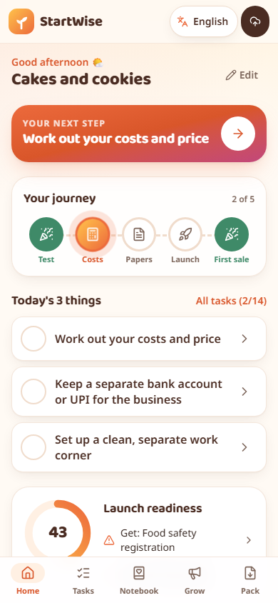
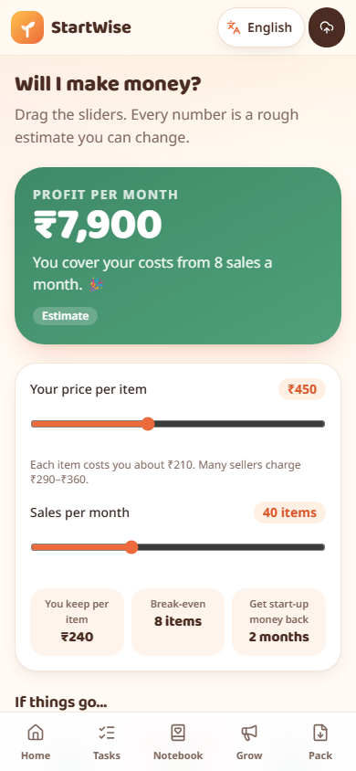
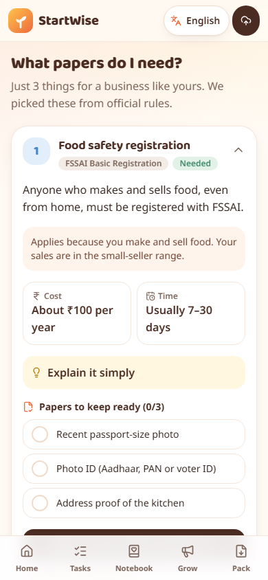
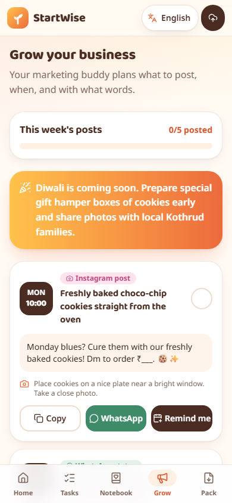
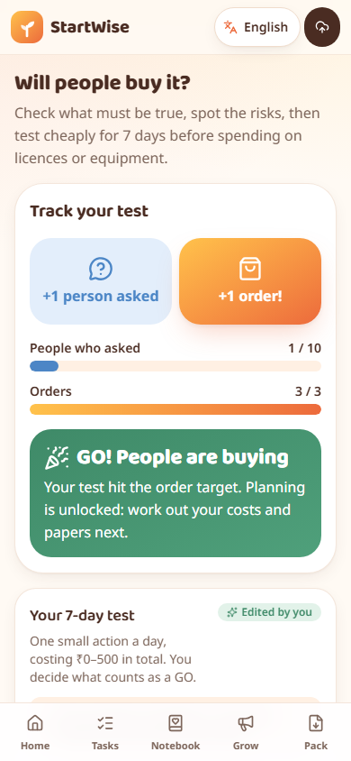
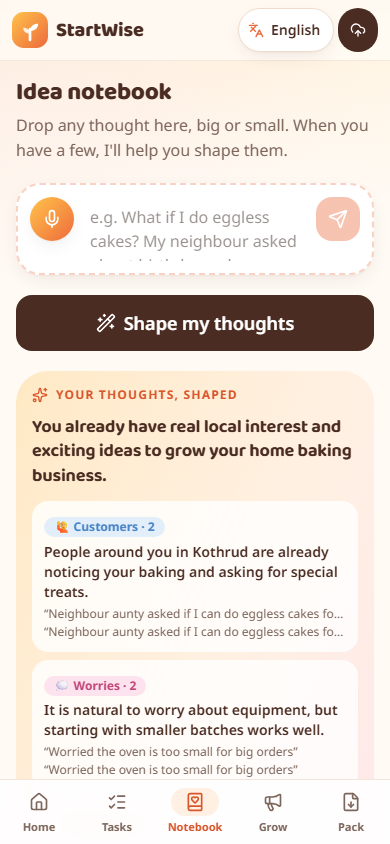
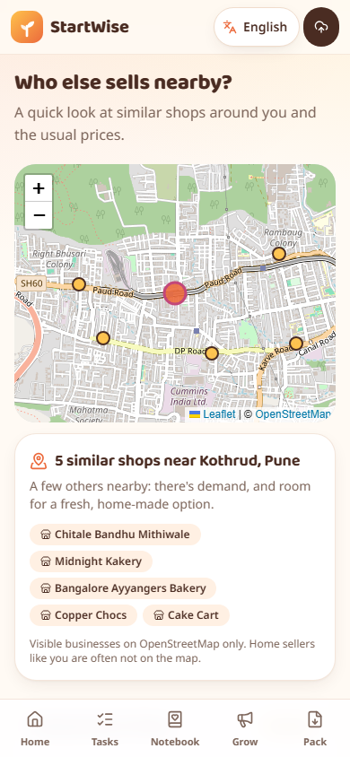

<div align="center">

# 🌱 StartWise

**Start wise. Launch right.**

Speak a business idea in English, Hindi or Marathi, and get a tested, source-backed launch plan and a tracked path to your first customer.

**She Solves 3.0** · Web & Software Development · Domain: Entrepreneurship · **Team200OK**

🔗 **Live app:** _coming soon (Vercel)_ · 🎬 **Example plan for judges:** `<live link>/demo` (opens Sunita's complete home-bakery plan, no login needed)

</div>

---

## 1. Problem statement

Aspiring entrepreneurs, especially first-time women founders running home businesses, have ideas but **no trusted guide to launch them**. The early journey is scattered: checking the idea, working out costs and pricing, finding which licences apply, discovering funding schemes and organising daily tasks all happen in different places, mostly in English and full of jargon. Generic AI chat gives one-off answers that can be outdated or invented, and paid agents handle only one task. A founder can describe the business but has no single guided workflow that turns *a thought* into *a plan she can act on*.

## 2. Proposed solution

StartWise is a **launch workspace, not a one-time chat answer**. It keeps the business profile, the numbers, the sources and the task list together, and it remembers progress.

1. **Say the idea** by voice or text, in your own language
2. **Answer at most 3 quick questions** by tapping choices
3. **Test it** with a ₹0–500, 7-day experiment and get a GO / NO-GO verdict
4. **Plan it**: only the licences that apply, live costs and break-even, matching schemes
5. **Grow it**: a weekly marketing plan, a sales diary and first-customer tools
6. **Take it away** as a Launch Pack PDF, and track every step

> **Core principle:** *AI understands and explains; reviewed data and formulas decide.* Licences, scheme matches, every number and the GO / NO-GO verdict come from reviewed data and plain TypeScript formulas, so the same profile always gives the same answer. Every legal fact links to its official source with a verified status.

Pilot scope: **Pune and Maharashtra**. Home food (home bakery) is built end to end; tailoring/boutique and online reselling are supported too.

## 3. Screenshots

| Start | Your business (Marathi) | Plan home |
| :---: | :---: | :---: |
|  |  |  |
| **Money Lab** | **What papers do I need?** | **Marketing buddy** |
|  |  |  |
| **7-day test: GO!** | **Idea notebook** | **Who sells nearby?** |
|  |  |  |

## 4. Features implemented

| Area | What works today |
| --- | --- |
| 🙏 **A warm first five minutes** | A friendly hello, then *"Which language do you prefer?"* (English · हिन्दी · मराठी). No forms, no sign-up wall. |
| 💬 **A real conversation** | WhatsApp-style chat: it asks her name, whether to **speak replies aloud or show text**, then listens to her idea and asks **one question at a time that fits HER business** (a tutor, a baker and a restaurant owner each get different questions). It never asks the obvious, keeps talking as long as she likes, and saves her worries and ideas to her notebook. |
| 🎙️ **Voice in three languages** | Live words while she speaks; Gemini transcribes the recording for accurate Hindi, Marathi and Hinglish. Replies can be spoken back (the phone's own voice, or Gemini's voice as a fallback). Typing always works. |
| 🔐 **Log in when it matters** | Only when she taps **"Make my plan"**: **Continue with Google** or email + password, with *"Don't have an account? Sign up"*. Her guest chat moves into her account. Guests aren't remembered; logged-in founders get *"Welcome back, Anita 👋 · Continue your plan"*. |
| 🧭 **A calm plan screen** | Only three things: **the next step**, a board-game **journey path** and **Today's 3 things** (with confetti). Everything else waits under **More tools**. A 3-step tour on the first visit. |
| 🗣️ **Talk to StartWise** | The round mic in the middle of the bottom bar opens a hands-free voice assistant that answers **from her own plan** (tasks, money, licences, orders), opens the right screen, adds tasks and logs sales for her. |
| 🧪 **Will people buy it?** | Assumptions and risk snapshot, a 7-day test (₹500 cap enforced in code), ready-to-send WhatsApp messages, poll and price card, **+1 enquiry / +1 order** tracker, automatic **GO / NO-GO** verdict and "adjust and retest". |
| 💰 **Will I make money?** | Starting cost estimates **for her kind of business** (a tiffin service gets tiffin boxes and groceries, not ovens), clearly labelled as AI estimates; editable one-time, monthly and per-item costs, price and sales sliders, live profit and break-even, a suggested price range, best/likely/worst cases, a 90-day cash chart and loan need. All labelled *estimate*. |
| 📄 **What papers do I need?** | **Verified against official sources on 4 Oct 2026** (FSSAI's April 2026 criteria: registration up to ₹1.5 crore turnover, ₹100/year; Udyam is free). A rule engine shows only the licences that apply (FSSAI registration, Udyam, labels; GST/state licence/shop registration only when scale or premises need them), each with a plain-language name, why, cost, time, a papers checklist, an "explain simply" panel, the official link, verified status and "this looks outdated". |
| 🤝 **Can I get money help?** | Scheme matcher (MUDRA Shishu/Kishore, PMEGP, CMEGP, Stand-Up India, MAVIM, CGTMSE) with "why this?", papers needed and **women-focused schemes highlighted**, plus a **bank loan pitch** written from your own numbers. |
| 🗺️ **Who sells nearby?** | Map of similar visible businesses around her area (OpenStreetMap), matched to her business (meals, bakeries, tuition, boutiques…), and reviewed Pune price ranges where we have them. |
| 📝 **Idea notebook + Worry box** | Drop messy thoughts by voice; **"Shape my thoughts"** groups them (customers, product, money, worries, ideas) and suggests next steps that become tasks. The worry box answers fears calmly with one small step for today. |
| 📣 **Marketing buddy** | A weekly WhatsApp status / Instagram plan with times, ready captions (English, Hinglish, Hindi, Marathi), photo tips, **"Remind me"** (Google Calendar), festival tips, local partnership ideas with ready messages, **brand-name ideas** and a shareable **WhatsApp price card** image. |
| 📸 **Photo → product** | Snap what you sell: AI names it and writes the caption and hashtags; the **price comes from her own costs**; one tap puts her real photo on a WhatsApp price card. |
| 🎭 **Practice room** | Rehearse out loud with an AI **bank officer**, a **haggling customer** or an **office buyer**, using her real plan, then get kind coaching feedback with stars. |
| 📒 **Order book** | Say an order (*"Priya, 2 tiffins for Sunday 5 pm, 400, 100 advance"*) and it fills itself in; see what's due today, what's still to collect, and send WhatsApp confirmations. |
| 🛍️ **First customers** | **Voice sales diary** ("Sold 2 cakes to Priya for 450 each" → ₹900 logged), monthly totals, a little customer list with WhatsApp follow-ups, and a free starter kit (WhatsApp Business, UPI QR, Google Business Profile). |
| ✅ **Tasks** | Personal roadmap from templates and applicable licences, by stage or 30/60/90 days, with dependencies, notes, evidence links and "I'm stuck". |
| 📦 **Launch Pack** | The whole plan as one A4 PDF in the chosen language (Devanagari prints correctly): profile, test results, licences, money, schemes, roadmap task sheet, plan starter and sources. |
| 🔊 **Read-aloud** | Listen to explanations in Hindi, Marathi or English (hidden if the phone has no voice for that language). |
| 🔒 **Trust & privacy** | Source + verified status on every rule; "Guidance, not legal advice" footer; no Aadhaar/PAN/bank details/photos collected; redaction before every AI call; each user sees only their own plans; **delete my data**. |
| 🛠️ **Admin (team only)** | Flagged-outdated items to review, records still to verify, and success metrics. |

## 5. Tech stack

| Layer | Technology |
| --- | --- |
| Frontend | **Next.js 16** (App Router, React 19, Server Actions), **TypeScript**, **Tailwind CSS 4**, lucide icons, Recharts, Leaflet |
| Languages | **next-intl** with message files for English, Hindi, Marathi; Noto Sans Devanagari + Baloo 2 fonts |
| Voice | Browser **Web Speech API** (live preview, en-IN / hi-IN / mr-IN) + **Gemini** audio transcription; spoken replies with the phone's **SpeechSynthesis** voice or **Gemini TTS** as a fallback |
| Backend | Next.js server actions and route handlers (TypeScript) |
| Database & auth | **Supabase** Postgres + Auth (JWT sessions; Google sign-in, email + password, anonymous guest sessions), **Drizzle ORM**, row-level security on, **pgvector** ready |
| AI | **Google Gemini** (`gemini-flash-latest`, `gemini-flash-lite-latest`, `gemini-embedding-001`) via plain `fetch`, strict JSON output checked with **zod**, one retry, backup-key rotation |
| Maps | OpenStreetMap tiles, Nominatim geocoding, Overpass API |
| Testing | **Vitest** (rule engine, money formulas, verdict, AI guardrails) · ESLint · TypeScript |
| Hosting | **Vercel** + Supabase |

### How the AI is used (and where it is not)

| Task | Done by |
| --- | --- |
| Understand the spoken or typed idea → structured profile | AI (strict JSON) |
| Which questions to ask, which licences apply, which schemes match | **Code + reviewed data** |
| Costs, break-even, cash flow, readiness score, GO / NO-GO | **Code (formulas)** |
| Plain-language explanations of rules | **Reviewed text** stored on each rule (3 languages) |
| Assumptions, test plan, templates, captions, notebook shaping, worry answers, loan pitch wording | AI drafts, always editable |

## 6. Installation & setup

**Requirements:** Node.js 20.9+ and a free Supabase project. A free Gemini API key from [aistudio.google.com](https://aistudio.google.com/apikey).

```bash
git clone https://github.com/tanvisheth1234-wq/startwise.git
cd startwise
npm install
cp .env.example .env.local     # then fill in the values below
npm run db:push                # creates the tables in your Supabase database
```

**Google sign-in (optional):** create an OAuth *Web application* client in Google Cloud with the redirect URI `https://<your-project>.supabase.co/auth/v1/callback`, then paste its Client ID and secret in **Supabase → Authentication → Sign In / Providers → Google**.

In **Supabase → Authentication → Sign In / Providers**, turn on **Allow anonymous sign-ins** (guests start without an account), and for local testing turn off **Confirm email**. Add `http://localhost:3000/login/callback` to the redirect URLs.

### Environment variables (`.env.local`)

| Variable | What |
| --- | --- |
| `NEXT_PUBLIC_SUPABASE_URL`, `NEXT_PUBLIC_SUPABASE_ANON_KEY` | Supabase project URL and anon/publishable key |
| `SUPABASE_SERVICE_ROLE_KEY` | Server only: used for delete-my-data |
| `DATABASE_URL` | Postgres connection string (Supabase transaction pooler) |
| `AI_PROVIDER` | `gemini` |
| `AI_API_KEY` | Gemini API key |
| `AI_API_KEY_2` | Optional backup key (another free project), used automatically on rate limits |
| `AI_MODEL`, `AI_EMBED_MODEL` | `gemini-flash-latest`, `gemini-embedding-001` |
| `ADMIN_EMAILS` | Comma-separated emails allowed to open `/admin` |
| `NEXT_PUBLIC_APP_URL` | Base URL, e.g. `http://localhost:3000` |

> Never commit `.env.local`. No test credentials are needed for evaluators: just open the app and start as a guest.

## 7. How to run

```bash
npm run dev        # development server at http://localhost:3000
npm run build      # production build
npm start          # run the production build
npm test           # unit tests
npm run lint       # ESLint
```

**Try it:** open the app → pick **मराठी** (or any language) → tell it your name → choose *speak* or *text* → say an idea like *"मला घरून डबा सर्विस सुरू करायची आहे"* → chat a little → **Make my plan** → sign up → explore. Or open **`/demo`** to jump straight into Sunita's complete example plan.

## 8. Project structure

```
startwise/
├── app/                          # Next.js routes
│   ├── page.tsx                  # Front door: hello + language choice, or "Welcome back"
│   ├── new/                      # The first conversation (name → voice choice → idea → chat)
│   ├── demo/                     # Sunita's complete example plan (for judges)
│   ├── plan/[planId]/            # Plan home and every module screen
│   │   ├── profile/              # "Here's your business"
│   │   ├── validate/             # 7-day test + GO / NO-GO
│   │   ├── money/  compliance/  funding/  market/
│   │   ├── roadmap/  notebook/  marketing/  first-customers/  orders/  practice/
│   │   └── launch-pack/ (+ print/)
│   ├── account/  login/  admin/
│   └── api/voice/                # transcribe (speech → text) and speak (text → speech)
├── src/
│   ├── knowledge/data.ts         # Reviewed rules, schemes, sources, tasks, cost & price estimates
│   ├── features/<module>/        # One folder per module: api.ts, actions, components, lib (+ tests)
│   │   ├── compliance/engine.ts  # Pure rule engine
│   │   ├── money/lib/calc.ts     # Money formulas
│   │   └── validate/lib/verdict.ts
│   ├── lib/ai/                   # The only code that talks to the AI (guardrails, redaction, key rotation)
│   ├── lib/auth/  lib/supabase/  # Sessions, guest accounts, data isolation
│   ├── db/schema/                # Drizzle schema (13 tables, RLS on)
│   ├── contracts/                # Shared types between modules
│   └── components/ui/            # Warm UI kit
├── messages/{en,hi,mr}/          # Every on-screen word in three languages
└── docs/screenshots/
```

## 9. Known limitations

- FSSAI, Udyam, MUDRA and Stand-Up India were **verified on 4 Oct 2026**; GST, PMEGP, CMEGP, MAVIM and CGTMSE still show **"Check locally"** until confirmed; every record links to its official source.
- **Google sign-in** is in Google's *testing* mode, so it works for the team's test accounts; everyone can sign up with email.
- Pilot data covers **Pune / Maharashtra**; other cities show general rules only.
- Uses **free Gemini tiers**: AI steps can take a few seconds and may slow down under heavy use (a backup key is rotated in automatically).
- Live words while speaking work best in Chrome/Edge; other browsers still get the accurate Gemini transcript after recording.
- The nearby map only shows businesses listed on OpenStreetMap; home sellers are often missing.
- Guests aren't remembered between visits (like most apps); log in to keep a plan.
- Spoken replies on laptops without a Hindi/Marathi voice use Gemini's voice and start after ~4 seconds; phones with built-in voices speak instantly.

## 10. Future scope

- More cities and states (adding a city = adding reviewed data, not code) and more business types
- Ask-a-question box answering only from official source pages (official texts and an ingestion script for pgvector are already in the repo)
- Phone-number login with OTP
- Document intelligence: read invoices, quotations or licences to pre-fill details
- WhatsApp bot and reminders by SMS/WhatsApp; a mobile app (PWA)
- Mentor and expert connect (CA, legal aid, self-help groups) and local founder communities
- Post-launch dashboard: sales, expenses, inventory and customers over time
- Links to UPI/accounting tools and real-time scheme updates

## 11. Team

**Team200OK**: Twissha Shah · Yaadi Chhadva · Simrit Kaur Chhatwal · Tanvi Sheth

---

<sub>Guidance, not legal advice. Fees, limits and eligibility can change; always confirm on the official portal. Sources: FoSCoS (FSSAI), Udyam Registration, GST portal, PMC, MUDRA, PMEGP (KVIC), Stand-Up India, Startup India, CMEGP, MAVIM, CGTMSE, OpenStreetMap.</sub>
